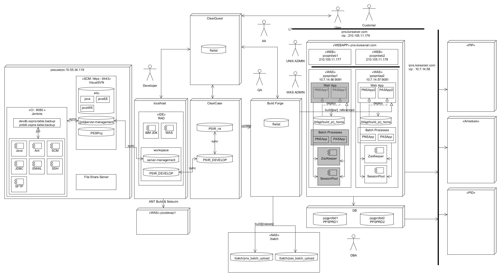

#  Server Architecture
기업 환경 구조로 Fail Over를 위한 HA 구조, 웹은 이중화, 배치는 이중화 되지 않음. 세션풀 절반 이중화 
 
* Batch 
* Web 
* Session Pool, Zoo Keeper 
* Network 
* Security 
* Test
* Interface
## Batch
전자정부 배치 프로젝트 차세대로 진행된 프로젝트로 시작 클래스는 com/kal/batch/scheduler/KalSchedulerJobRunner.java 시작클래스 VM변수는 serverType과 hostname필요, 인자 값은 배치 jobname임.
전자정부 배치 프로젝트 내의 스프링 배치 remarks로 비동기 서비스로 구동 되고 있음. org/springframework/batch/core/launch/support/CommandLineJobRunner.java 시작 클래스 VM변수 상동, 인자 값은 batch/job/pns9903Job.xml pns9903Job time=$(date +%Y%m%d%H%M%S) 3개임.
별도 프로젝트의 스프링 배치 UMS 전송 기존 전자정부 배치 미통합되었음, 통합하려면 별도 시간 어려움 소요될 것으로 예상. 현재 전체 메세지 발송과 PDF발송 부분으로 프로그램 나누어짐 구동 부분은 전자정부 배치 프로젝트 내의 스프링 배치와 상동
## Web
전자정부 기반 배치로 실 사용하는 웹 서블릿은 스프링(org/springframework/web/servlet/DispatcherServlet.java), IBM 웹스피어 방식의 JAX-WS 웹서비스(com/kal/pnsws/PNSSRVWSV01SOAPImpl.java) 입니다.
## Session Pool, Zoo Keeper
아마데우스에 OFFICEID에 할당된 W/S 요청량의 리소스 개수를 관리하기 위한 프로젝트로 인터넷북킹프로젝트로 진행 되었으며, 이중화로 변경 되었으며 PNS의 CC/CQ에 올라가 있음. 공용 서버에 이전 버전이 올라가 있음 d드라이브 framework에 있음.
## Security
보안은 웹 요청 구간의 HTTPS를 사용(AA 진행), 전송되는 데이터에 대한 암호화는 SAFENET을 사용하고 있으며 양방향 암호화를 사용 하고 있음. 현재 적용은 URL 및 PWD, EML, TEL의 컨택스트를 해당 서버에 Sample/CryptoClientSample.do로 확인 가능함.
PWD는 표준 프레임워크 내에 암복호화 수행 조치 및 빌드로 조치함, EML, TEL를 퍼시스턴스 레벨에 적용, SSN은 기존 프로젝트로 소스레벨로 암복호화 수행됨.
## Test
타시스템은 본인은 JUnit 기반의 단위 및 통합테스트를 하고 있으며, 소스의 품질 및 개인 역량을 올리는데 도움이 될꺼라고 판단이 되나 품질 영역 기반 개발 방법론으로 필요하면 제공을 함.
## Interface
웹서비스 - 제공된 웹서비스 만드는 방법은 메일 확인 후 추후 업데이트 
REST/JSON - 서비스 제공 부분은 PAS의 com/kal/pas/controller/PasApiController.java 및 BCN에 com/kal/bcn/controller/BcnController.java로 적용됨, 서비스 받는 부분은 com/kal/pns/service/impl/Pns031202ServiceImplB.java에 RestTemplate로 적용 되었으나 지금 사용 안함. 
SFTP - 전자정부 내에 기존 프로젝트 적용된 부분 ex) com/kal/pns/service/impl/Pns030301ServiceImplB.java로 SFTPUtil검색 , 기업통합 패턴(com/kal/fms/eip/ftp/FtpApp.java)으로 적용된 부분이 있음.

